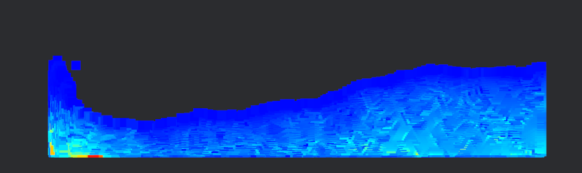

# bevy_gpu_fluid
## GPU Fluid Simulation (Paused)
> **GPU-accelerated Smoothed-Particle Hydrodynamics for Bevy 0.16**
> _Early work-in-progress – APIs will change until v0.1_
> _Currently a CPU prototype_
> _Compute Shader with CPU readback implemented_
> _GPU rendering in progress_


This project implements a GPU-accelerated 2D fluid simulation using SPH and Bevy’s custom render pipeline.
Short term Goal: Simulate water entirely on the GPU and render it in real time.

- GPU math and CPU rendering integrated
- Full shader rendering incomplete
- Cleanup phase now in progress to improve modularity and clarity

For more information please look [docs](docs).

## Current Status

- **CPU prototype:** Fully working, interactive 2D SPH  
- **GPU simulation bridge:** Compute shaders handle simulation, but particle positions are read back to the CPU for Bevy sprite rendering  
- **Next step:** GPU rendering with no CPU readbacks

---

## Overview

This protype implements SPH (Smoothed-Particle Hydrodynamics) in Bevy.
The long term goal is to providfe a fully GPU-accelarated and rendered fluid dynamics.
1. CPU Version with [docs](docs/sprint2)
2. GPU Bridge with [docs](docs/sprint3)

### CPU Version
The 2D CPU-based prototype is available for testing and algorithm validation.


|  |  |
|------------------------------------------|------------------------------------------|
| Solid Color                              | Density Color Mapping                    |

#### Features (CPU prototype)
- 2D SPH simulation using Poly6, Spiky and Viscosity kernels normalized for 2D
- Interactive mouse-driven fluid manipulation
- Switching between visualization modes is possible:
  - Solid color
  - Density color mapping   
- The parameters are not hardcoded and can be changed easily:
  - smoothing length
  - stiffness
  - viscosity
  - mass
  - etc.

#### Controls & Demos

| Action | Key / Mouse | Demo |
|--------|-------------|------|
| Switch view mode | `Space` |  |
| Click + drag to disturb fluid | Left mouse button |  |


#### Quick start
```bash
git clone https://github.com/ArminGEtemad/bevy_gpu_fluid.git
cd bevy_gpu_fluid
cargo run --release --example sph2d_cpu_demo  # demo scene with density and solid color view
```

### GPU Bridge
Mathematically identical to the CPU version. 


The calculation is done on the GPU using compute shaders (`WGSL`). However, the rendering is done on CPU using Bevy sprites by copying back to the CPU. This bridge is written to
- test compute shaders
- monitor performance
- visualize GPU result using familiar Bevy tools before using GPU for rendering

The result on a i7-14700KF and RTX 4070 Ti SUPER is as follows

| Particles | Avg FPS (~3s) |
|-----------|----------------|
| 10,000    | 188.0          |
| 5,041     | 191.3          |
| 1,024     | 202.8          |

This bench is not on `benches` but `examples`.

There is a parity test for density and pressure kernel.
The worst relative error after 10 steps for density was about 0.3%
The worst relative error after 10 steps for pressure was about 9% that corresponds to a 9 physical unit disagreement. For more information look [here](docs/sprint3) in "Parity Test" section.
The integration partiy test shows a slight drift with a maximum difference of 0.005448 in displacement and of 2.734728 in velocity after 10 steps.

#### Quick start
```bash
git clone https://github.com/ArminGEtemad/bevy_gpu_fluid.git
cd bevy_gpu_fluid
cargo run --release --example gpu_demo # for the demo
cargo run --release --example bench_gpu # for FPS bench
cargo run --release --example gpu_parity10 # parity test for Density/Pressure kernels 
cargo run --release --example gpu_integration_parity # parity test for integral
```


