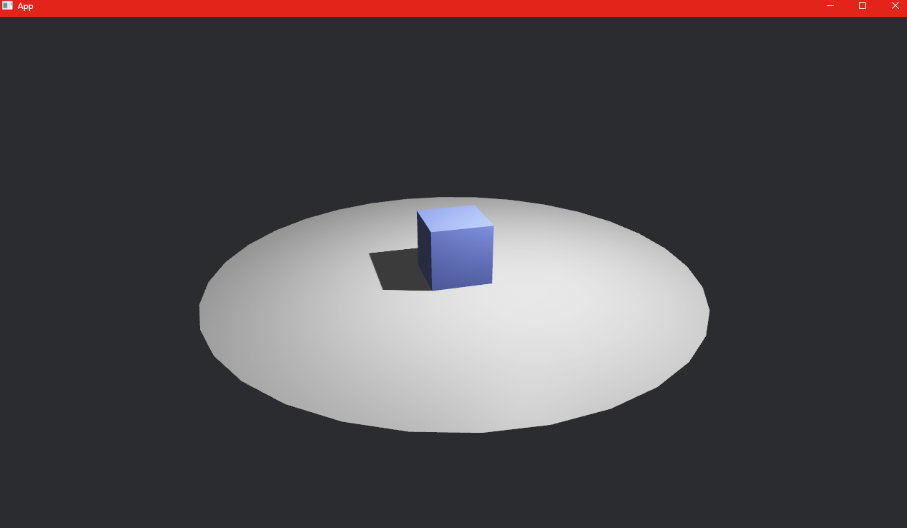
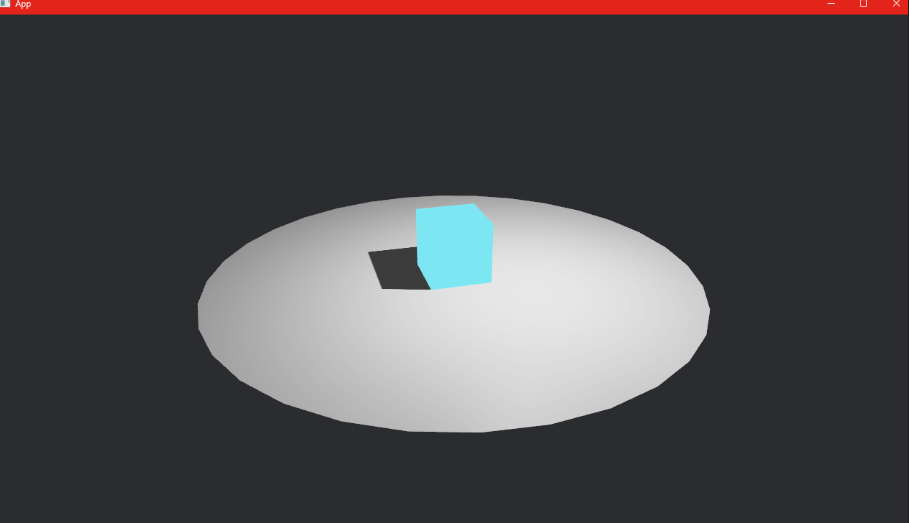

# Goals
The goals in sprint 1 was not only warming up for the real project but also to make sure that the setup work correctly and the foundation of this project is laid. 
1. The bevy projects boots
2. WGSL scripts can indeed communicate with the scene
3. The simple spinning scene is interactive
4. Working CI
## Bevy Project Boots
For this project I am using Bevy 0.16.1. There was no issue in starting Bevy and making a sample scene. 
The sample scene is easy to create and for the warm up, I used help from [Bevy Examples](https://github.com/bevyengine/bevy/tree/main/examples/3d).

What made Bevy very interesting was the fact that the developer is close to the system. There is no pre programmed sample scene, camera and light as in other game engines. Also there are no toolbars where we could just drag a GameObject like a cube and drop it in the scene. (I of course assume that Bevy will become more and more user friendly with time.)

The sample scene was as following:



## WGSL script
Right now the WGSL script is very simple. It just defines a new color for the cube. There were interesting challenges, however!
this is how I first coded the group:

```wgsl
@group(1) @binding(0) var<uniform> color : vec4<f32>
``` 

it only resulted in an error:

>Handling wgpu error as fatal by default

I would assume that @group(1) is already in use and cannot be customized. That is why I used

```wgsl
@group(2) @binding(0) var<uniform> color : vec4<f32>
``` 

The next challenge was actually defining the color. At first, I thought for color I have to use `Color` type as in the spin.rs script 

```rust
 // cube
    let mat = solid_mats.add(SolidColor {
        color: Color
```

However, for a solid custom color, I had to use `vec4<f32>` and 

```rust
 // cube
    let mat = solid_mats.add(SolidColor {
        color: LinearRgba { red: f32, green: f32, blue: f32, alpha: f32 }
```

The result is 



It is intentional that the cube has a solid color with no texture and no realistic reaction to the light in the scene. As mentioned already, this was just done to make sure that there is no problem on the system and WGSL communicates with my scene. 

## Interactive spinning scene
Now the goal is to make the scene interactive, meaning having control over camera and light. These control can later be used for the real scene. When working with the fluids it is important to have full control over the camera and the light to observe the flow. 
Right now the camera can be 
1. moved using WASD (faster if SHIFT is pressed)
2. zoomed in and out using mouse wheel
3. rotate around (0, 0, 0) when we move the mouse while wheel is pressed
we can also toggle between the camera and the light using TAB. However, the difference is that the light moves on a sphere with a radius that can be changed using mouse wheel, i.e., WASD doesn't change the distance of the light to (0, 0, 0) but mouse wheel does. [Unofficial Bevy Cheat Book/Input Handling](https://bevy-cheatbook.github.io/input.html) helped me a lot with this part.

The cube does spin. I have also made it possible for the light to spin around (0, 0, 0) just for didactic reasons for myself and then put the speed to 0.0 (it is intentional!)

Here what took some time from me was the fact that the resource for the mouse buttons and the keyboards keys where different (obvious when I say it like this but it wasn't at that moment)
also mouse motion and the mouse wheel have `EventReader`. 

```rust
fn scene_control(
	time: Res<Time>,
    keys: Res<ButtonInput<KeyCode>>,
    mouse_button: Res<ButtonInput<MouseButton>>,
    mut evr_motion: EventReader<MouseMotion>,
    mut evr_scroll: EventReader<MouseWheel>,
    mut control_target: ResMut<ControlTarget>,
    mut query: Query<(&mut Transform, &SceneControl)>,
) // more code
```

Time is another thing to take into account (Here my experience with Unity made it easy not to forget)

## CI
Knowing if a fresh Linux system (just how a stranger would hopefully at some point) can compile my code is important. 
What I realized was that my code at first could not be compiled on a fresh Linux system. The issue what ALSA/udev error which was then solved by
```bash
run: |
          sudo apt-get update
          sudo apt-get install -y pkg-config libasound2-dev libudev-dev
```

after installing these packages the code was compiled swimmingly. 